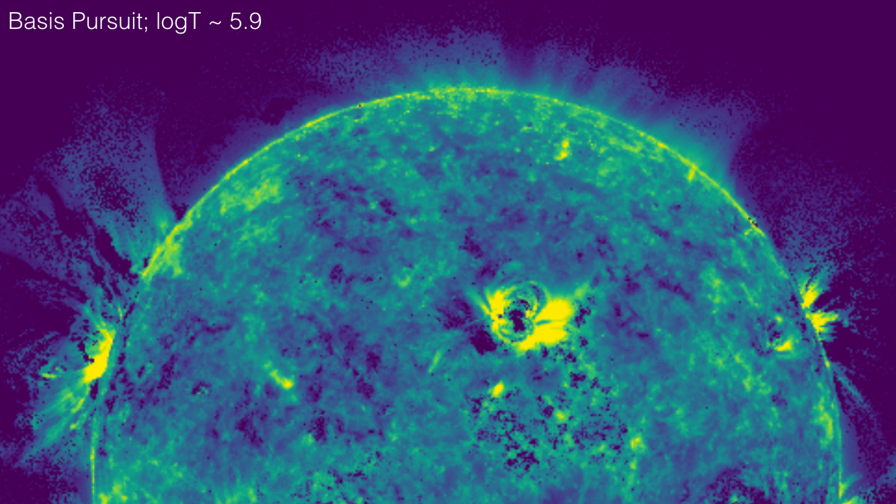

DeepEM: A Deep Learning Approach for DEM Inversion
============================================
*by Paul Wright et al*

The intensity observed through optically-thin SDO/AIA filters (94 Å, 131 Å, 171 Å, 193 Å, 211 Å, 335 Å) can be related to the temperature distribution of the solar corona (the differential emission measure; DEM) as

In this equation, g_i is the DN/s/px value in the <i>i</i>th SDO/AIA channel. This intensity corresponds to the K_i(T) temperature response function, and the DEM, ξ(T), is in units of cm^-5 K^-1. The matrix formulation of this integral equation can be represented in the form, g = <b>K</b>ξ, however, this problem is an ill-posed inverse problem, and any attempt to directly recover ξ leads to significant noise amplication.

There are numerous methods to tackle mathematical problems of this kind, and there are an increasing number of methods in the literature for recovering the differential emission measure including methods based techniques such as Tikhonov Regularisation (<a href="https://doi.org/10.1051/0004-6361/201117576">Hannah & Kontar 2012</a>), on the concept of sparsity (<a href="https://doi.org/10.1088/0004-637X/807/2/143">Cheung et al 2015</a>).

In the attached notebook (DeepEM.ipynb) we will introduce a deep learning approach for Differential Emission Measure (DEM) Inversion. <i>For this notebook</i>, `DeepEM` is a trained on one set of <i>SDO</i>/AIA observations (six optically-thin channels; 6 x N x N) and DEM solutions (in 18 temperature bins from logT = 5.5 - 7.2, 18 x N x N; [Cheung et al 2015](https://doi.org/10.1088/0004-637X/807/2/143)) at a resolution of 512 x 512 (N = 512) using a 1x1 2D Convolutional Neural Network with a single hidden layer.

The `DeepEM` method presented here takes every DEM solution with no regards to the quality or existence of the solution. As will be demonstrated, when this method is trained with a single set of <i>SDO</i>/AIA images and DEM solutions, `DeepEM` solutions have a similar fidelity to Sparse Inversion (with a significantly increased computation speed—on the order of 10 million DEM solutions per second), and additionally, `DeepEM` finds positive solutions at every pixel, and reduced noise in the DEM solutions.

This notebook was developed with [PyTorch](https://pytorch.org/).

  
Example of the `DeepEM` solution for logT ~ 5.9 K, in comparison to the Sparse Inversion solution for the same temperature.

--

Directory Structure
============================================

    .
    ├── DeepEMData                            # Files required for DeepEM.ipynb
    │   ├── AIA_DEM_2011-01-27.aia.npy        # Train AIA
    │   ├── AIA_DEM_2011-01-27.emcube.npy     #   ...  DEM
    │   ├── AIA_DEM_2011-01-27.status.npy     #  ...  STATUS  
    │   ├── AIA_DEM_2011-02-22.aia.npy        # Valdn AIA
    │   ├── AIA_DEM_2011-02-22.emcube.npy     #  ...  DEM
    │   ├── AIA_DEM_2011-02-22.status.npy     #  ...  STATUS
    │   ├── AIA_DEM_2011-03-20.aia.npy        # Test  AIA
    │   ├── AIA_DEM_2011-03-20.emcube.npy     #  ...  DEM
    │   ├── AIA_DEM_2011-03-20.status.npy     #  ...  STATUS 
    │   └── AIA_Resp.npy                      # AIA Temp. Responses
    ├── DeepEM_Deep_Neural_Net                # Working directory for a fully trained NN for DEM Inversion
    │   └── ...                                 This is currently in development.
    ├── Misc                                  # Files required for README.md
    │   ├── DeepEMGif2.gif
    │   ├── EqOne.png
    │   └── README.md
    ├── SDO2018_Workshop                      # Presentation given at SDO LWS 2018 conference (Gent, Belgium) 
    │   └── DeepEM_Workshop.pdf               # PDF Presentation
    ├── DeepEM.ipynb                          # DeepEM Notebook
    └── README.md                             # README.md (this file)
    
  

