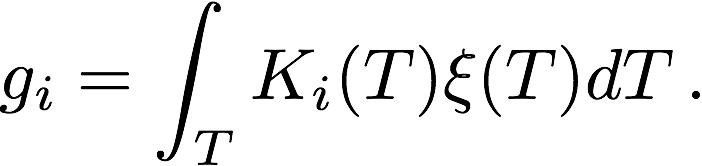

# DeepEM: A Deep Learning Approach for DEM Inversion

The intensity observed through optically-thin SDO/AIA filters (94 Å, 131 Å, 171 Å, 193 Å, 211 Å, 335 Å) can be related to the temperature distribution of the solar corona (the differential emission measure; DEM) as

In this equation, g_i is the DN/s/px value in the <i>i</i>th SDO/AIA channel. This intensity corresponds to the K_i(T) temperature response function, and the DEM, ξ(T), is in units of cm^-5 K^-1. The matrix formulation of this integral equation can be represented in the form, g = <b>K</b>ξ, however, this problem is an ill-posed inverse problem, and any attempt to directly recover ξ leads to significant noise amplication. 

There are numerous methods to tackle mathematical problems of this kind, and there are an increasing number of methods in the literature for recovering the differential emission measure including methods based tecniques such as Tikhonov Regularisation (Hannah & Kontar 2012), on the concept of sparsity (Cheung et al 2015). In the following notebook, we will demonstrate how a simple 1x1 2D convolutional neural network allows for significant improvement in computational speed for DEM inversion with similar fidelity to the method used for training (Basis Pursuit). Additionally this method, DeepEM, provides solutions with values of emission measure >0 in every temperature bin.
